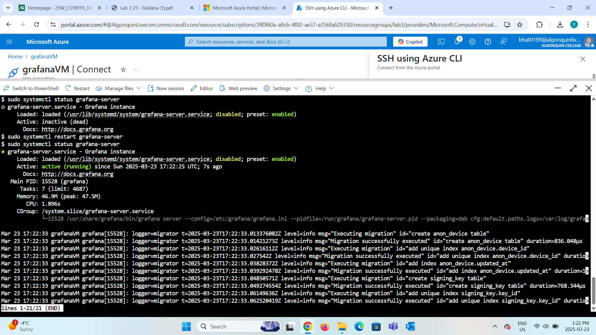
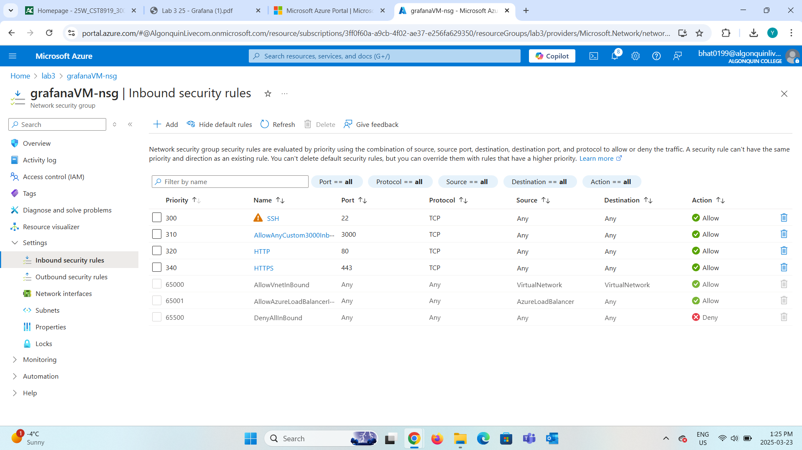
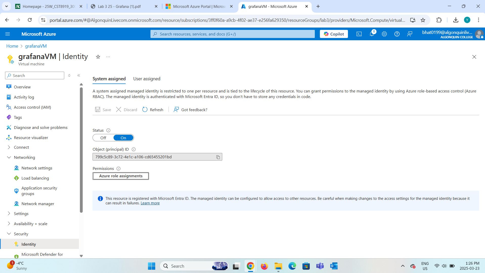
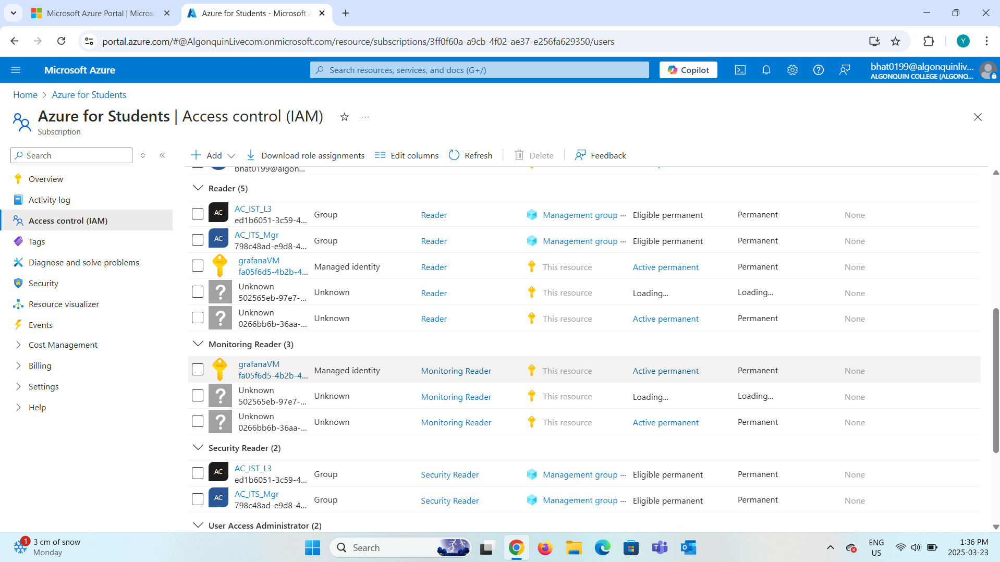
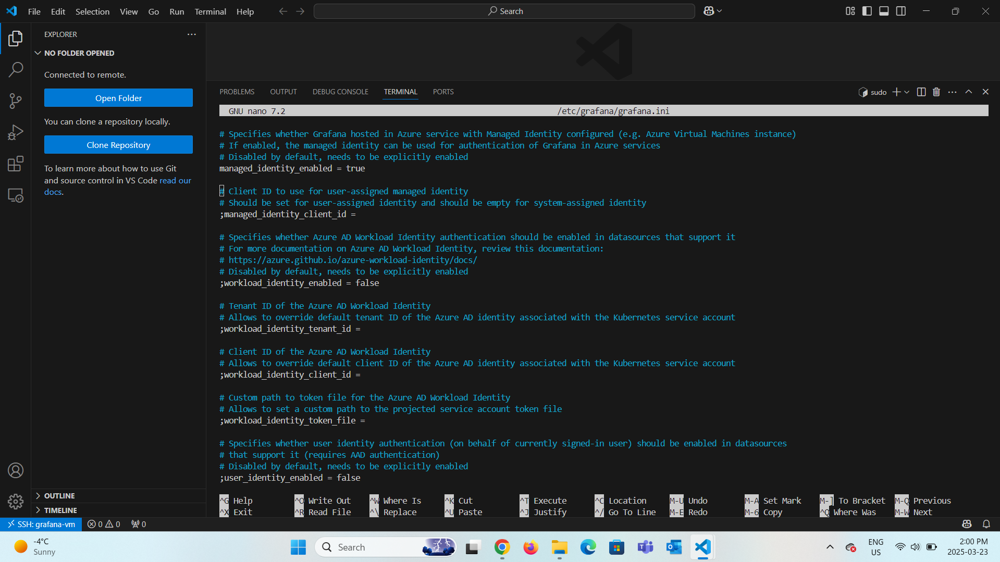
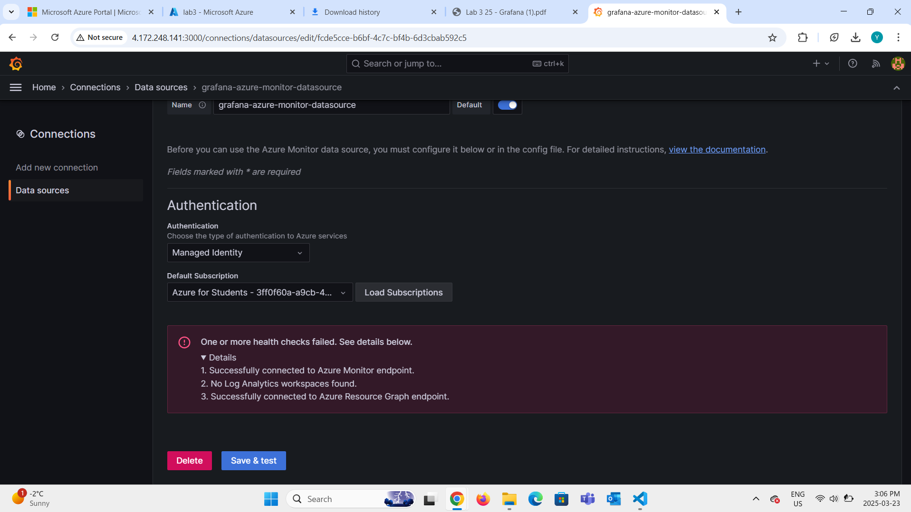
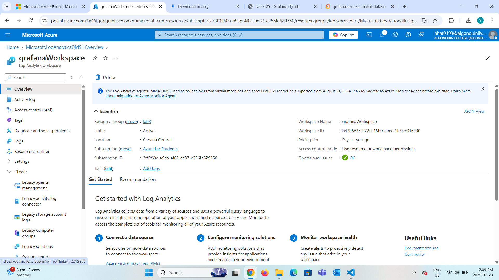
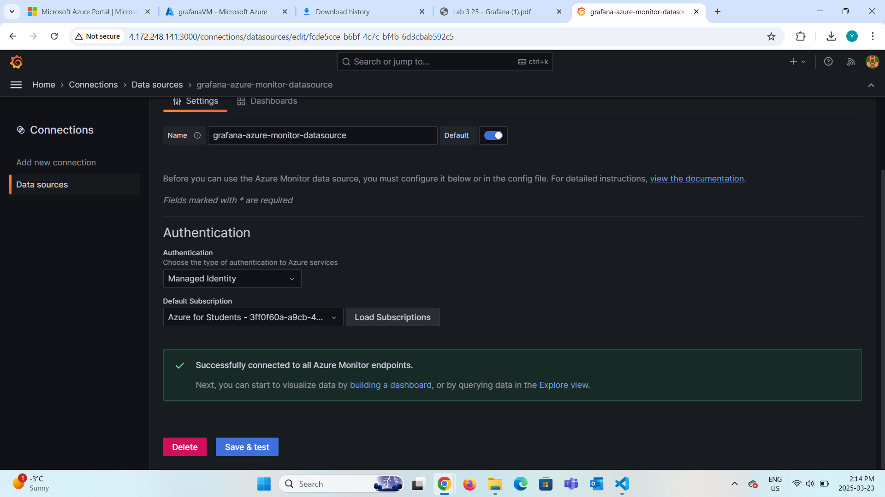
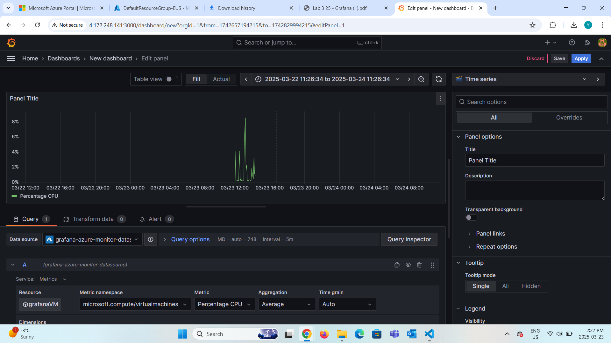
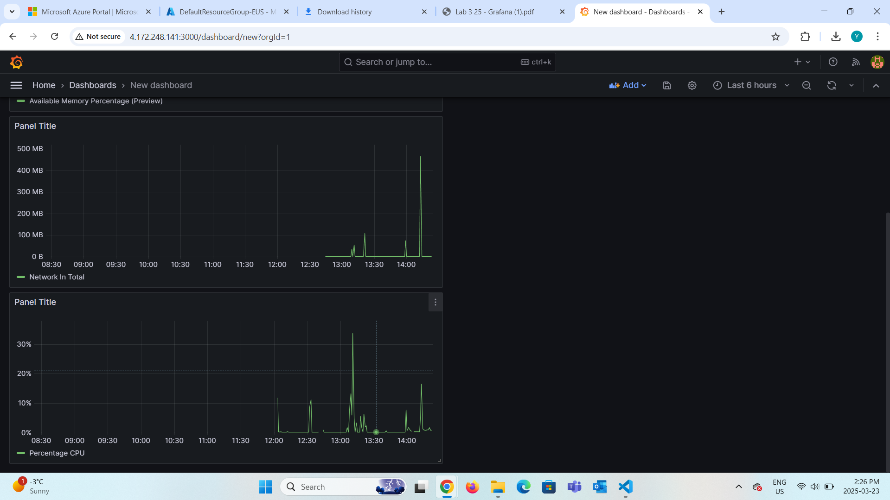

## Lab: Grafana Installation and Dashboard Creation on Ubuntu Server

## Lab Objective

To install Grafana on an Ubuntu server (hosted on Azure), configure it to collect performance metrics using Azure Monitor, and visualize those metrics using Grafana dashboards.

---

## Steps Completed

### 1. Prepare Ubuntu Server

- Created an Ubuntu VM on Azure.
- Updated the system using:

```bash
sudo apt-get update && sudo apt-get upgrade -y
```

- Connected to the VM using VS Code Remote-SSH and a `.pem` SSH key.

---

### 2. Install Grafana

- Added Grafana’s official APT repository and GPG key.
- Installed Grafana using `apt-get` and verified that the service is running:

```bash
sudo systemctl start grafana-server
sudo systemctl enable grafana-server
sudo systemctl status grafana-server
```


- To make Grafana accessible in the browser, port 3000 was opened by adding an inbound rule in the Azure VM's Networking settings.



---

### 3. Configure Grafana for Azure Monitor

- Enabled System Assigned Managed Identity on the Azure VM.
- Assigned these roles in Azure:
  - Monitoring Reader on Azure Monitor
  - Reader on the Subscription
- Edited the Grafana config file at `/etc/grafana/grafana.ini`:

```ini
managed_identity_enabled = true
```

- Restarted the Grafana service to apply changes.







---

### 4. Issue Faced: No Log Analytics Workspace Found

While adding Azure Monitor as a data source in Grafana, it showed:

> “No Log Analytics workspaces found”



#### Resolution:

- Created a new Log Analytics Workspace in Azure.
- Linked the VM to the workspace via:  
  Virtual Machine > Monitoring > Insights > Enable
- After a short delay, metrics appeared in Grafana.





---

## Dashboard Creation

- Created a new dashboard in Grafana.
- Added a panel to visualize Percentage CPU:
  - Data Source: Azure Monitor
  - Metric Namespace: microsoft.compute/virtualmachines
  - Metric: Percentage CPU
  - Aggregation: Average
- Saved and applied the panel using the time-series graph format.





---

## Screenshots Included

- Grafana installation terminal output
- Azure Managed Identity and Role Assignments
- Adding port 3000 in Networking Inbound rules
- Edited Grafana config file (`grafana.ini`)
- Azure Monitor configured as data source in Grafana
- Issue Faced and resolution
- Final dashboard with performance metrics

---

## Result

Successfully installed and configured Grafana to monitor an Azure Ubuntu VM using Azure Monitor and Managed Identity. Created a working dashboard displaying real-time performance data for CPU usage.
